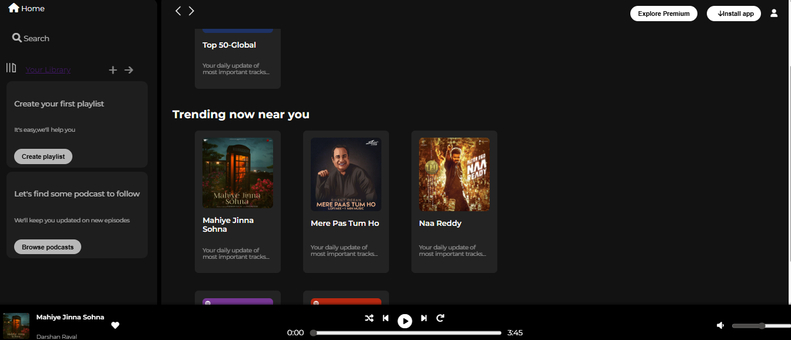

# 🌟 Professional Portfolio Website

A modern, responsive portfolio website showcasing skills, projects, and experience. Built with clean HTML5, CSS3, and JavaScript.

## 🚀 Features

### ✨ Design & User Experience
- **Modern Design**: Clean, professional layout with beautiful gradients and animations
- **Fully Responsive**: Optimized for all devices (desktop, tablet, mobile)
- **Smooth Animations**: Scroll-triggered animations and hover effects
- **Interactive Elements**: Dynamic typing animation, floating elements, and parallax effects

### 🎯 Sections
- **Hero Section**: Eye-catching introduction with animated elements
- **About**: Personal introduction with statistics and achievements
- **Skills**: Organized skill categories with modern card design
- **Projects**: Featured project showcase with hover effects and links
- **Contact**: Interactive contact form with validation and social links

### 🛠️ Technical Features
- **Smooth Scrolling**: Seamless navigation between sections
- **Mobile Navigation**: Hamburger menu for mobile devices
- **Form Validation**: Client-side form validation with notifications
- **Performance Optimized**: Throttled scroll events and efficient animations
- **SEO Friendly**: Semantic HTML structure and proper meta tags

## 💻 Technologies Used

- **HTML5**: Semantic markup and modern structure
- **CSS3**: Advanced styling with Flexbox, Grid, and animations
- **JavaScript (ES6+)**: Modern JavaScript with DOM manipulation
- **Font Awesome**: Professional icons
- **Google Fonts**: Inter and Poppins fonts for typography

## 🎨 Design Features

- **Color Scheme**: Modern purple and gold gradient theme
- **Typography**: Professional font pairing with Inter and Poppins
- **Layout**: CSS Grid and Flexbox for responsive layouts
- **Animations**: CSS keyframes and JavaScript intersection observers
- **Interactive Cards**: Hover effects and smooth transitions

## 📱 Responsive Design

- **Desktop**: Full-featured layout with sidebar navigation
- **Tablet**: Adapted layout with optimized spacing
- **Mobile**: Hamburger menu and stacked sections

## 🚀 Getting Started

1. Clone the repository
2. Open `index.html` in your browser
3. Customize the content with your own information
4. Replace placeholder images with your actual project screenshots
5. Update contact information and social links

## 📁 Project Structure

```
portfolio/
├── index.html          # Main HTML file
├── style.css           # Main stylesheet
├── script.js           # JavaScript functionality
├── assets/             # Images and media files
├── screenshot.png      # Portfolio preview
└── README.md          # Project documentation
```

## 🎯 Customization

### Personal Information
- Update name and title in the hero section
- Modify the about section with your story
- Add your actual skills and technologies
- Replace project information with your work

### Styling
- Customize colors in CSS variables
- Modify animations and transitions
- Adjust responsive breakpoints
- Update fonts and typography

### Content
- Add your actual project images
- Update social media links
- Modify contact information
- Add or remove sections as needed

## 📸 Preview



## 🌟 Key Highlights

- **Modern UI/UX**: Professional design with attention to detail
- **Performance**: Optimized for fast loading and smooth interactions
- **Accessibility**: Semantic HTML and keyboard navigation support
- **Cross-browser**: Compatible with all modern browsers

## 🔮 Future Enhancements

- Add dark mode toggle
- Implement blog section
- Add project filtering
- Include testimonials section
- Add loading animations
- Integrate with a backend for contact form

## 👩‍💻 Made with ❤️ by Prachi

A passionate frontend developer creating beautiful web experiences.

---

*This portfolio template is perfect for developers, designers, and creative professionals looking to showcase their work in a modern, professional way.*
